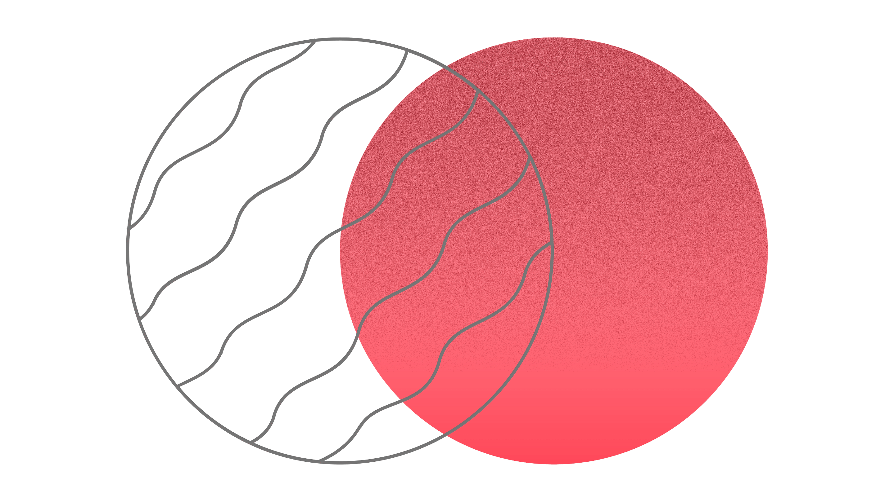
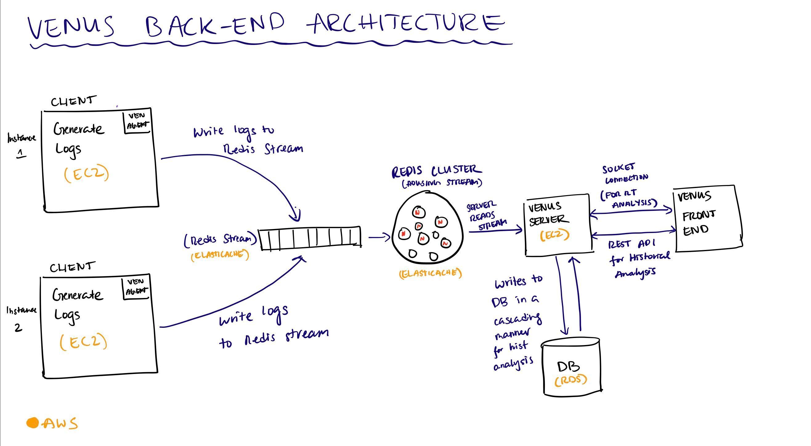
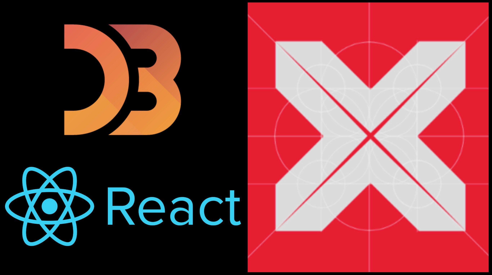

<div align="center">
  
  </div>

<h1 align="center">Venus</h1>


#
[](https://github.com/oslabs-beta/venus)


## Table of Contents

[Install Dependencies](#install-dependencies)

- [Description](#description)
- [Motivation](#motivation)
- [Features](#features)
- [A Brief Overview of Venus](#A-Brief-Overview-of-the-Venus-Orbit)
- [Getting Started with Venus](#Getting-started-with-venus)
  - [Clone the Repo](#Clone-the-repo)
  - [Install Dependencies and Run Scripts](#Install-Dependencies-and-run-scripts)
  - [Configuring the Agent](#Configuring-the-Agent-with-Node.js-and-AWS-Elasticache)
- [Technologies](#technologies)
- [Contributing](#contributing)
- [License](#license)

#
#### [Return to Top](#Venus)

<br>

## Description

Venus is a lightweight, self-hosted service monitoring tool that provides customizable, real-time and historical data on critical health metrics of service dependencies.

<br>

## Motivation

As the popularity of microservice architectures has grown, managing the complexity and keeping tabs on the health of service dependencies is increasingly critical. While many service monitoring solutions exist as a subset of heavier end-to-end solutions, Venus aims to provide a point solution that gives users a flexible, lightweight solution that enables them to monitor KPIs on all of their applications. Additionally, Venus is self-hosted and therefore users only incur costs for storage and compute. 

<br>

## Features
* Real-time rolling averages on service specific KPIs including Availability, Response Time, Load, and Error Rate.
* Service specific KPI threshold settings for quick glance report cards.
* Historic panel data on KPI statistics for Past Hour, Past Day, Past Week, Past Month intervals.
* Dependency Graph visual that maps service structure and methods. 
* Server side authentication for secure storage and distribution of analytics. 

<br>

## A Brief Overview of the Venus Orbit 



There are three key phases of The Venus Orbit:

1. Collecting data: 
  - When deploying instances of an app, users will require in a Node.js wrapper that intercepts and logs all HTTP/HTTPS requests and responses to external service dependencies. Each wrapper is configured to write these logs to a read/write stream configured on a Redis cluster. The Redis cluster serves as a secure temporary storage for the raw log data, following LRU caching protocols. 
  
2. Analyzing data: 
 - The Redis Cluster stream is then read from the Venus server and at a specified interval, the server reads from the stream and pipes the data to a Danfo.js based module for analysis. After analysis, the data is sent via websocket to the GUI for visualization. 
 - For historical data, the Venus server pipes the data from the Redis stream at a specified cadence and is then processed, analyzed and stored in a series of cascading data tables ready to be served. Panel data flows to the frontend interface via a RESTful API.
 
 3. Viewing data: 
 - To view the data, users must launch a local version of the Venus Electron GUI. Upon load, users will be prompted to enter the full server address of their server instance. Upon render, the websocket handshake is established with Venus server instance and both real-time and historic data is automatically fetched and rendered. 
 - Service specific analytics will populate the dashboard and will continue to give users updates on their server until they end their session by navigating to the Sign Out tab. A successful sign out wipes all session data and returns users to the Venus login page.    


#
##### Return to [Top](#Venus)

<br>

# Getting Started With Venus 


## A Note on Self Hosting

Given Venus's open source, self-hosted nature - it will ultimately depend on you to set up the necessary caching, data store and processing services in order to utilize the full functionality of Venus. We've leveraged AWS in our implementation, but ultimately how you choose to host it is at your discretion.  


## Clone the Repo

Clone the repo onto your either your local machine or a compute resource like EC2. You'll need to run two instances to spin up both the client-side GUI as well as the Venus server. 


```
git clone https://github.com/oslabs-beta/venus.git
```

<br>

## Install Dependencies and Run Scripts

Within the parent directory of Venus download all of the dependencies. 

```
npm install
```


## Configuring the Venus Instance

The instructions below outline the use case for someone hosting their application on AWS. However, note that the configuration of Venus will ultimately depend on the storage, caching, and compute provide of choice. 

First update the `.env` and `src/config` files with all of the necessary inputs needed to set up the application: 

```
STREAM_KEY = 'stream_name' // Name of the redis stream 
REDIS_HOST = 'redis.cache.amazonaws.com' // Link where your Redis caching is hosted
REDIS_PORT = 6379 // Redis port to interact with 
DB_NAME = 'AWS_RDS_user' // Database username
DB_PASS = 'AWS_RDS_pass' // Database password (if leveraging authentication)
AWS_REGION = 'us-east-2' // Region your database is hosted in (if using AWS)
DB_HOST = 'db.cluser.aws-region.rds.amazonaws.com' // Database host link
DB_PROXY = 'rds-proxy-aurora-postgres.proxy-id.aws-geo.rds.amazonaws.com' // Database proxy link (if using RDS proxy)
DB_PORT = 5432 // Database port to access DB instances
EC2_HOST = 'ec2.amazonaws.com' // EC2 link if deploying Venus in the cloud
HTTP_PORT = 3000 // HTTP server port
SOCKET_PORT = 8080 // // Socket port
```

Once you've configured the Venus instance with all of the necessary cloud services, the next step will be to implement the wrapper into your application's code. 


## Setting up the Wrapper

In order to set up the wrapper, you'll need to require it inside of your server file as follows: 

```javascript
const express = require('express');
const app = express();

/** VENUS AGENT */
const venusWrapper = require('../wrapper/venus-wrapper');
venusWrapper();
```

Now the wrapper function `venusWrapper()` will log all outbound HTTP / HTTPS requests from your application and write to the Redis stream!


## Running the Electron Application

Run both of the following commands in separate terminals inside the Venus parent directory to spin up the Electron GUI

```
npm run dev:react
```
```
npm run dev:electron
```

## Running the Venus server

Run the following command inside of the Venus parent directory to spin up the Venus server

```
npm run server-test
```

<br>

## Technologies
- <a href="#"></a>

- <a href="#"></a>

- <a href="#"></a>

- <a href="#"></a>

- <a href="#"></a> 

- <a href="#"></a>

- <a href="#"></a> 

- <a href="#"></a> 

- <a href="#"></a> 

- <a href="#"></a> 

- <a href="#">  Ant Design</a> 

- <a href="#"></a>  

- <a href="#"></a>  

- <a href="#"></a>

<br>

## Contributing

Development of Venus is open source on GitHub through the tech accelerator umbrella OS Labs, and we are grateful to the community for contributing bugfixes and improvements. Read below to learn how you can take part in improving Venus.


### Potential for Improvement
* The addition of Metrics for dynamic and historic data.
* Webhook integration for user alerts on threshold triggers.
* DB storage for user thresholds. 


<br>

- [Contributing](https://github.com/oslabs-beta/Venus/blob/main/CONTRIBUTING.md)

<br>

## Authors
* Akshay Suggula [asuggula](https://github.com/asuggula)
* Oliver Roldan [oproldan1](https://github.com/oproldan1)
* Will Kencel [wkencel](https://github.com/wkencel)
* Vlad Munteanu [vxm5091](https://github.com/colinvandergraaf)
* Evan Perlman [evperlman](https://github.com/evperlman)

## Special Thanks:
Sanjay Lavingia, Shyam Venkataraman, Kesav Mulakaluri, Santosh Mohan, Mike Soennichsen, Julie Wu, Will Bladon, Justin Cohen and Nick de los Santos Jr. for their thoughtful feedback and guidance.  

## License

#MIT


#
#### [Return to Top](#Venus)
