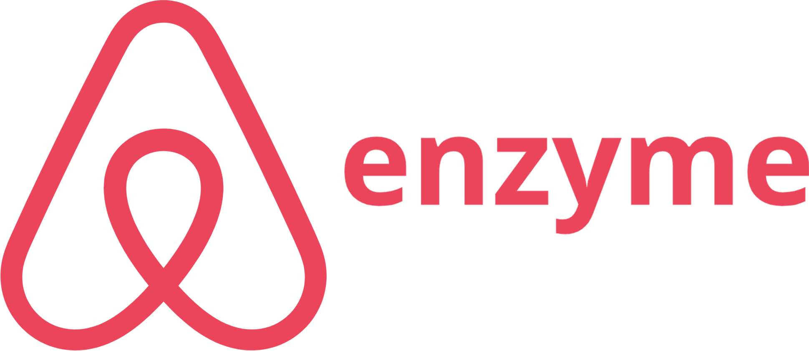
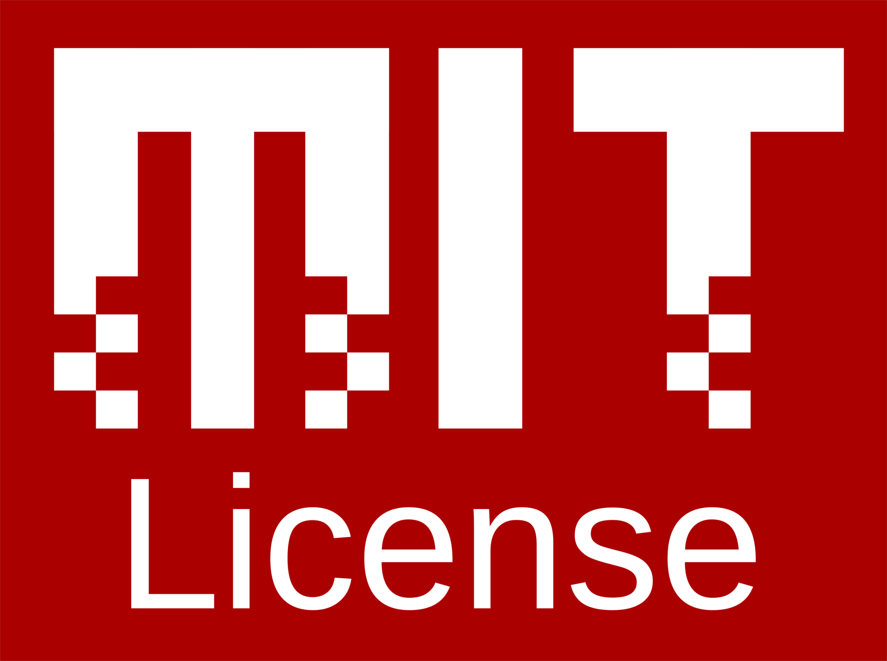

<a href="#"></a>
# Venus


#
[](https://github.com/oslabs-beta/venus)


## Table of Contents

[Install Dependencies](#install-dependencies)

- [Description](#description)
- [Motivation](#motivation)
- [Features](#features)
- [A Brief Overview of Venus](#A-Brief-Overview-of-the-Venus-Orbit)
- [Demo](#demo)
- [Getting Started with Venus](#Getting-started-with-venus)
  - [Clone the Repo](#Clone-the-repo)
  - [Install Dependencies and Run Scripts](#Install-Dependencies-and-run-scripts)
  - [Configuring the Agent](#Configuring-the-Agent-with-Node.js-and-AWS-Elasticache)
- [Technologies](#technologies)
- [Contributing](#contributing)
- [License](#license)

#
#### [Return to Top](#Venus)

<br>

## Description

Venus is a lightweight, self-hosted service monitoring tool that provides customizable, real-time and historical data on critical health metrics of service dependencies.

<br>

## Motivation

As the popularity of distributed server architectures has grown, so has the need for a centralized and singular source of truth on the health. While many of these services exist as large packages, Venus aims to give users a flexible suite of baseline statistics on their deployed apps. Additionally, Venus is configured within AWS so users will have direct access to their logs and only pay market rate for storage and computation as their apps grow in size. 

<br>

## Features
* Real-time rolling averages on service specific KPIs including Availability, Response Time, Load, and Response Error.
* Service specific KPI threshold settings for quick glance report cards.
* Historic panel data on KPI statistics for Past Hour, Past Day, Past Week, Past Month intervals.
* Dependency Graph visual that maps service structure and methods. 
* Server side authentication for secure storage and distribution of analytics. 

<br>

## A Brief Overview of the Venus Orbit 


There are three key phases of The Venus Orbit:

1. Collecting your data: 
  - When deploying instances of their app, users will require in a Node.js wrapper that intercepts and logs all HTTP/HTTPS requests to external service dependencies. Each wrapper is configured to write these logs to an AWS Elasticache hosted Redis Cluster in a readable stream. The Redis cluster serves as a secure temporary storage for the raw log data, following LRU queue/cache protocols. 
2. Analyzing your data: 
 - The Redis Cluster stream is connected to a EC2 instance of the Venus client in a pub/sub relationship. At a set interval, the Venus client reads from the stream and pipes the relevant data to Danfo.js for vectorized calculations. After appending the new log informations for the services to the rolling average of the services, the information is sent via websocket to the Electron user interface for visualization. 
 - Historic panel data and analysis for the services are generated by cascading tables that populate via internal thresholding. They are directed to the frontend interface via a RESTful Venus API. 
 3. Viewing your Data: 
 - To access this information, a user must launch a local version of the Venus Electron GUI. Upon load, users will be prompted to enter the full server address of their EC2 Venus instance and their secret. If the secret and server address are valid and pass a tokenization process the user gains access to the analytics dashboard. With an access token, a websocket connection is established between the EC2 and the GUI and historic data is automatically fetched from the API at the aggregate level. 
 - Service specific analytics will populate the dashboard and will continue to give users updates on their server until they end their session by navigating to the Sign Out tab. A signout wipes all session data and returns users to the Venus login page.   


#
##### Return to [Top](#Venus)

<br>

# Getting Started With Venus 


## Clone the Repo

```
git clone https://github.com/oslabs-beta/venus.git
```

<br>

## Install Dependencies and Run Scripts

within the parent directory of Venus download the dependencies. 

```
npm install
```
run 
```
npm run dev:react
```
then in a second concurrent terminal run
```
npm run dev:electron
```

## Configuring the Agent with Node.js and AWS Elasticache.


<br>

## Technologies
- <a href="#"></a>

- <a href="#"></a>

- <a href="#"></a>

- <a href="#"></a>
  * React Router
  * React Context API/ React Hooks

- <a href="#"></a> 
  * Elasticache
  * EC2
  * RDS

- <a href="#"></a>

- <a href="#"></a> 

- <a href="#"></a> 

- <a href="#"></a> 

- <a href="#"></a> 

- <a href="#">  Ant Design</a> 
  - Ant Design Charting Libraries 

- <a href="#"></a>  

- <a href="#"></a>  <a href="#"></a>

<br>

## Contributing

Development of Venus is open source on GitHub through the tech accelerator umbrella OS Labs, and we are grateful to the community for contributing bugfixes and improvements. Read below to learn how you can take part in improving Venus.


### Potential for Improvement
* The addition of Metrics for dynamic and historic data.
* Webhook integration for user alerts on threshold triggers.
* Persistent user thresholds. 
*

<br>


- [Contributing](https://github.com/oslabs-beta/Venus/blob/main/CONTRIBUTING.md)

<br>

## Authors
* Akshay Suggula [asuggula](https://github.com/asuggula)
* Oliver Roldan [oproldan1](https://github.com/oproldan1)
* Will Kencel [wkencel](https://github.com/wkencel)
* Vlad Munteanu [vxm5091](https://github.com/colinvandergraaf)
* Evan Perlman [evperlman](https://github.com/evperlman)

# Special Thanks:
Sanjay Lavingia
Mike Soennichsen 
Julie Wu
Will Bladon
Justin Cohen 

## License

Venus is <a href="#"></a> [licensed.](https://github.com/oslabs-beta/Venus/blob/master/LICENSE.md) 


#
#### [Return to Top](#Venus)
